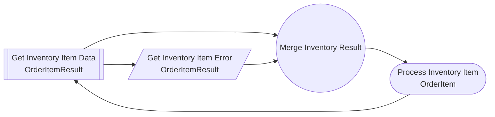

# Pipeline: inventoryItem

```mermaid
flowchart LR
  s1[["Get Inventory Item Data
OrderItemResult"]]
  s2[/"Get Inventory Item Error
OrderItemResult"/]
  s3(("Merge Inventory Result"))
  s4(["Process Inventory Item
OrderItem"])
  s4 --> s1
  s1 --> s2
  s1 --> s3
  s2 --> s3
  s3 --> s4
```
