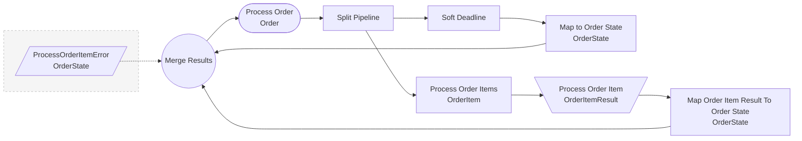

# Pipeline: order

```mermaid
flowchart LR
  subgraph ext[" "]
    style ext fill:#f5f5f5,stroke:#bbb,stroke-dasharray:4
    s5[/"ProcessOrderItemError
OrderState"/]
  end
  s6["Map Order Item Result To Order State
OrderState"]
  s7["Map to Order State
OrderState"]
  s8(("Merge Results"))
  s9(["Process Order
Order"])
  s10[\"Process Order Item
OrderItemResult"/]
  s11["Process Order Items
OrderItem"]
  s12["Soft Deadline"]
  s13["Split Pipeline"]
  s10 --> s6
  s12 --> s7
  s7 --> s8
  s6 --> s8
  s5 -.-> s8
  s8 --> s9
  s11 --> s10
  s13 --> s11
  s13 --> s12
  s9 --> s13
```
